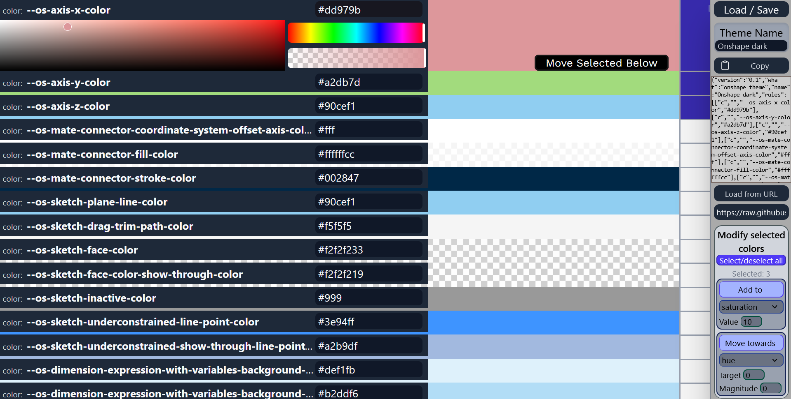

# Onshape plus

### Theme manager web extension for Onshape.

Create themes in the editor, choose from ready-to-use themes, or import user-created themes, and easily apply them to Onshape!



 
# CHOOSE A MORE OBVIOUS example image!

### Get the browser extension:
<a href="https://example.com">
  
</a>
<a href="https://example.com">
  
</a>

---

### Basic usage

Open the theme manager popup by clicking the icon in your toolbar

picture of that

Select which theme will be loaded based on Onshape's dark/light theme switch. Reload Onshape for the change to take place.

Manage your themes in the tab made by the Manage themes button

Update your theme saves in the Load / Save dialog,

Get user created themes by loading from a URL using the button by that name, or by simply pasting the data into the raw data area. Then, in the Load / Save dialog, save it to a new slot. **There is no autosave**

### Making/modifying your own themes

When making a theme, you usually want to start from an existing preset.

For simple-ish themes, where you just want to change the main color scheme, the fastest strategy is to select all of the rules from the same color block and modify them using the 'modify selected colors' tools. To select rules click a box on the right side to select one, and shift click another to select all between them (you can also use this to deselect rules). Now, you can modify all of those rules at once. If you wanted change red colors which you selected to green, you could have the 'Add to' box say :

> hue
> 
> Value: 120

Now, when you click the 'Add to' button, it will convert all the colors to [HSL](https://developer.mozilla.org/en-US/docs/Web/CSS/Reference/Values/color_value/hsl), and add 120° to all the hues of all the colors you had selected.

If you wanted to make everything a bit darker, you could do 'Move towards, lightness, 0, 0.1' which would move all selected colors 10% of the way to lightness 0. 

Basic usage of this extension is simply overwriting the built-in global CSS variables Onshape uses to define things, but you can get more specific (or broad) than this using css selectors.

Beyond simple color variable, you can set the values of basically any css property of any element.

![Labeled rule. rule type[0],CSS selector[1], Key[2], value[3]](sample-rule.png)

In this example, it selects every \ element nested inside of something with class="os-select-field" and sets the CSS filter to "invert".

This can be used for things like background-image, background-color, text-color, and anything else

You can import other stylesheets using the import rule type, which is primarily useful for fonts

If you're wondering how something in one of the default themes works, I recommend loading it into the editor and taking a look for yourself

You can add a new rule with the new rule button, or by editing the json.

A combination of these tools can be used to make cool themes.

You *can* also take the raw JSON data and run it through your own custom script, but you shouldn't need to for normal use.

## Help

If you are confused or need help with anything, you can read through the source code message me on discord at ```dhmango``` or email me at dhmango@dhmango.anonaddy.com

If you found a bug or have suggestions for improvements, you can contact me or make an issue in github. Or, you can make a pull request, and I will try to look at it.

---

<small> This project is not endorsed by, affiliated with, maintained, authorized, or sponsored by PTC or Onshape </small>
